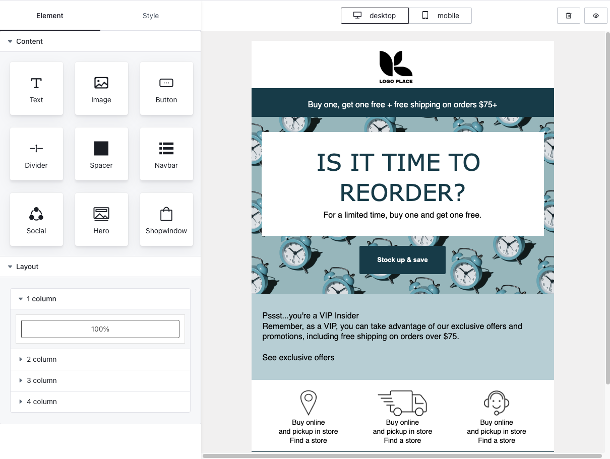
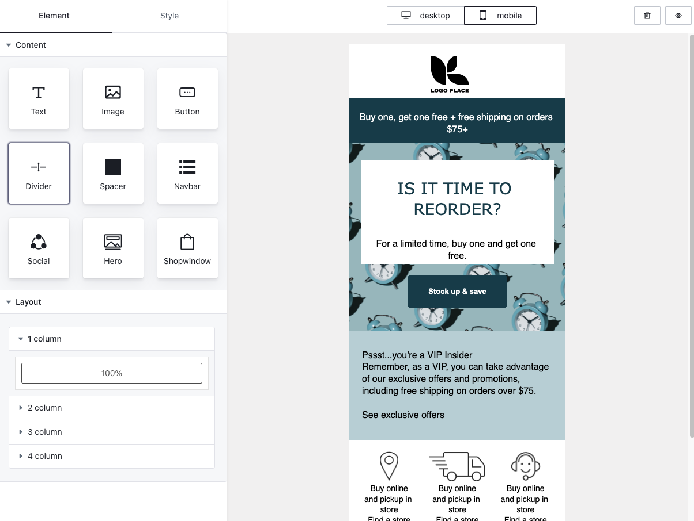
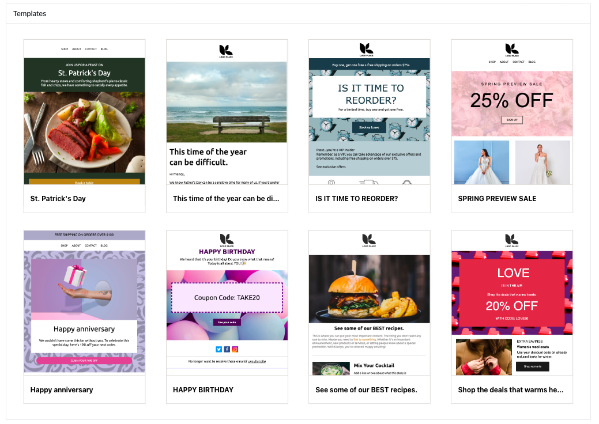

Easy-email-pro simplifies the creation of responsive email templates by combining the editing capabilities of SlateJS with the compatibility of MJML. With drag-and-drop functionality, inline editing, and keyboard shortcuts, users can easily design visually appealing and feature-rich email templates.

Build marketing campaigns, newsletters, or transactional emails effortlessly with Easy-email-pro. Create professional-grade responsive email templates efficiently.

<div style="font-size:0">
  
  
</div>
<br/>
<div>
  
</div>

## Live Demo

Check out the live demo here https://demo.easyemail.pro/full


## vite Demo

https://github.com/Easy-Email-Pro/easy-email-pro-demo

## Nextjs Demo

https://github.com/Easy-Email-Pro/easy-email-pro-nextjs-demo

## Check out plans

[Plans](https://www.easyemail.pro/?utm_source=demo-repo#pricing)

## Getting started

```bash
 npm install --save easy-email-pro-core easy-email-pro-editor easy-email-pro-theme @arco-design/web-react @arco-themes/react-easy-email-pro mjml-browser slate slate-react slate-history
```

## Create your editor

```jsx
import React, { useCallback, useMemo } from "react";
import {
  EmailEditorProvider,
  EmailEditorProps,
  EmailTemplate,
} from "easy-email-pro-editor";
import { EditorCore, BlockManager, ElementType } from "easy-email-pro-core";
import { Retro } from "easy-email-pro-theme";
import 'easy-email-pro-theme/lib/style.css';

// Theme style, If you need to change the theme, you can make a duplicate in https://arco.design/themes/design/6979/setting/base/Color
import '@arco-themes/react-easy-email-pro/css/arco.css';

export default function MyEditor() {

  // You can fetch data from the server.
  const initialValues: EmailTemplate | null = useMemo(() => {
    return {
      subject: 'Welcome to Easy Email Pro',
      content: {
        "data": {
          "breakpoint": "480px",
          "globalAttributes": {
            "font-family": "Arial, sans-serif"
          }
        },
        "type": "page",
        "children": [
          {
            "type": "standard-section",
            "data": {},
            "attributes": {},
            "children": [
              {
                "type": "standard-column",
                "data": {},
                "attributes": {},
                "children": [
                  {
                    "type": "placeholder",
                    "data": {},
                    "attributes": {},
                    "children": [
                      {
                        "text": ""
                      }
                    ]
                  }
                ]
              }
            ]
          }
        ],
        "attributes": {
          "background-color": "#f5f5f5",
          "content-background-color": "#ffffff"
        }
      }
    };
  }, []);

  // example
  const onUpload = (file: Blob):Promise<string> => {
    return Promise.resolve('https://res.cloudinary.com/dfite2e16/image/upload/v1681907056/clgnivsuj0018z9ltiixmxf6k/ilh6rri61f512i7wb6yd.png')
  }

 const onSubmit: (values: CustomEmailTemplate)=> {
  console.log(values)
 }

const config = Retro.useCreateConfig({
    // Paid clients fill in the Client ID here, not "FREE". 
    // Want a one-week trial? Please contact ch.mao@qq.com.
    clientId: "FREE", 
    height: "calc(100vh - 66px)",
    onUpload,
    initialValues: initialValues,
    onSubmit: onSubmit,
    showSourceCode: true,
    showLayer: true,
    showPreview: true,
    showSidebar: true,
    compact: false,
    showDragMoveIcon: true,
    showInsertTips: true,
})

  return (
   <EmailEditorProvider
      {...config}
    >
      <Retro.Layout height={"calc(100vh - 40px)"}></Retro.Layout>
    </EmailEditorProvider>
  );
}
```
